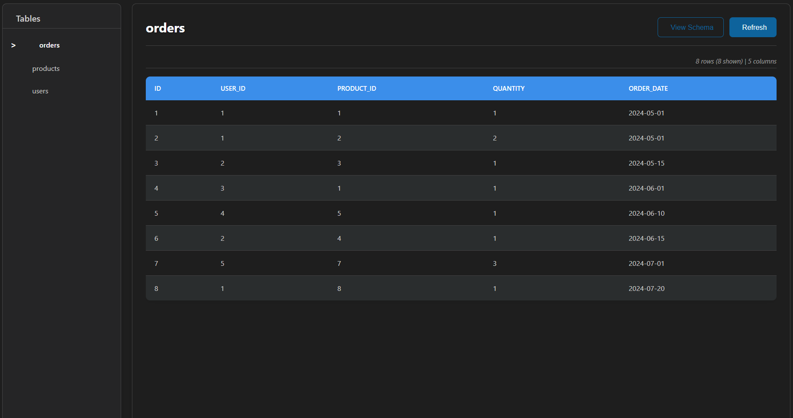

<div align="center">


# DB Viewer

**A beautiful, intuitive SQLite database viewer built right into Visual Studio Code**


*Your all-in-one solution for exploring SQLite databases without leaving VS Code.*

[Installation](#installation) • [Quick Start](#quick-start) • [Features](#features) • [Usage Guide](#usage-guide)

</div>

---

<div align="center">



</div>

## Why DB Viewer?

Tired of switching between VS Code and external database tools? **DB Viewer** brings the power of SQLite database exploration directly into your favorite editor. With a beautiful, native interface that feels like part of VS Code itself, you can instantly inspect and understand your database structure and data.

## Installation

### Method 1: VS Code Extensions Marketplace

1. Open VS Code and go to **Extensions** (`Ctrl+Shift+X`)
2. Search for **"DB Viewer"**
3. Click **Install**

### Method 2: Command Line

```bash
code --install-extension MJStudio.db-viewer
```

### Method 3: VSIX File

```bash
# Download the .vsix file from releases
code --install-extension path/to/db-viewer.vsix
```

## Quick Start

Getting started takes seconds:

1. Locate your database file in VS Code's Explorer
2. Right-click any SQLite database file (`.db`, `.sqlite`, `.sqlite3`, `.db3`, etc.)
3. Select **"Open with Database Viewer"**

That's it! Your database will open in a beautiful, interactive viewer.

## Features

### Smart Table Navigation

- **Sidebar Explorer**: Clean list of all tables with selection indicators
- **Quick Search**: Filter tables by name (coming soon)
- **Row Counts**: See table sizes at a glance

### Native VS Code Experience

```typescript
// Feels like part of VS Code
theme: 'vs-code-native',
responsive: true,
darkMode: 'auto'
```

### Rich Data Presentation

- **Sticky Headers**: Column names always visible while scrolling
- **Type Indicators**: Clear data type badges (INTEGER, TEXT, etc.)
- **Smart Truncation**: Handles long content gracefully
- **Performance Optimized**: Smooth scrolling with large datasets

### Safe & Secure

- **Read-Only Access**: Your data stays protected
- **No Modifications**: Zero risk of accidental changes
- **Local Processing**: All data stays on your machine

## Usage Guide

### Opening Databases

| Method | Steps | Best For |
|--------|-------|----------|
| **Right-Click** | Right-click file → "Open with Database Viewer" | Quick access |
| **Command Palette** | `Ctrl+Shift+P` → "Open Database" | Keyboard users |
| **Default Handler** | Just click the database file | Everyday use |

### Understanding the Interface

```text
Database Viewer
├── Sidebar (Tables List)
│   ├── users (1,243 rows)
│   ├── posts (5,892 rows) 
│   └── comments (12,847 rows)
│
└── Main Viewer
    ├── Column Headers (sticky)
    ├── Data Rows (first 1000 shown)
    └── Horizontal/Vertical Scroll
```

### Supported File Types

| Extension | Description | Compatibility |
|-----------|-------------|---------------|
| `.db` | SQLite Database | Full |
| `.sqlite` | SQLite Database | Full |
| `.sqlite3` | SQLite 3 Database | Full |
| `.db3` | SQLite 3 Database | Full |
| `.s3db` | SQLite 3 Database | Full |
| `.sl3` | SQLite 3 Database | Full |
| `.sdb` | SQLite Database | Full |
| `.sqlitedb` | SQLite Database | Full |

## Performance & Limits

DB Viewer is optimized for performance while maintaining a smooth user experience:

| Feature | Limit | Reason |
|---------|-------|--------|
| **Rows Displayed** | 1,000 per table | Performance & usability |
| **File Size** | No hard limit | Limited by system memory |
| **Concurrent DBs** | One at a time | Focused workflow |

> **Tip**: For very large tables, focus on specific data subsets using the upcoming query features.

## Troubleshooting

### Common Issues & Solutions

<details>
<summary><b>Database won't open</b></summary>

**Symptoms**: File doesn't open or shows error

**Solutions**:
- Verify file is valid SQLite: `file yourdatabase.db`
- Check file permissions
- Test with SQLite CLI: `sqlite3 yourdatabase.db ".tables"`

```bash
# Quick validation command
sqlite3 yourdatabase.db "SELECT name FROM sqlite_master WHERE type='table';"
```

</details>

<details>
<summary><b>Tables appear empty</b></summary>

**Symptoms**: Table opens but shows no data

**Check**:
- Table actually contains data
- Database isn't corrupted
- Try reloading VS Code window

```bash
# Check table contents
sqlite3 yourdatabase.db "SELECT COUNT(*) FROM your_table;"
```

</details>

<details>
<summary><b>UI looks broken</b></summary>

**Solutions**:
- Reload VS Code window (`Ctrl+Shift+P` → "Developer: Reload Window")
- Check for extension updates
- Try switching VS Code theme

</details>

## Roadmap

### Coming Soon

- [ ] **SQL Query Interface**: Run custom queries
- [ ] **Export Capabilities**: CSV, JSON export
- [ ] **Schema Visualization**: ER diagrams
- [ ] **Table Relationships**: Foreign key navigation

### Future Possibilities

- Multiple database connections
- Data filtering and sorting
- Binary data preview
- Query history

## Contributing

We welcome contributions! Here's how you can help:

- **Report Bugs**: Create an issue with detailed steps to reproduce
- **Suggest Features**: Share your ideas for improvement
- **Code Contributions**: PRs welcome! See our contributing guide

### Development Setup

```bash
git clone https://github.com/thedatascientiist/db-viewer.git
cd db-viewer
npm install
code .
```

## License

This project is licensed under the **MIT License** - see the [LICENSE](LICENSE) file for details.

## Acknowledgments

- **VS Code Team** for the amazing extension API
- **SQL.js contributors** for the SQLite implementation
- **Our Users** for feedback and support

---

<div align="center">

### Enjoying DB Viewer?

Give us a rating and leave a review on the VS Code Marketplace!

**Made with ❤️ Love by Mujeeb ur Rehman**

*Making database exploration beautiful and accessible*

</div>
